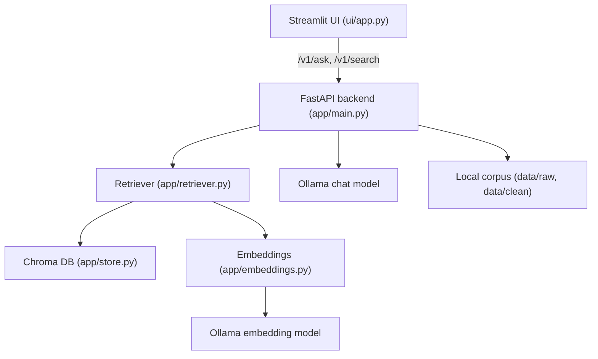

# Ask HR (Local) — Architecture Overview

Ask HR (Local) is a local-first retrieval-augmented Q&A system for HR documents. It ingests, indexes, and answers questions over your own HR corpus, with grounded answers and citations.

## Architecture Diagram

## End-to-End Flow

1. **Ingest**: Place HR files in `data/raw/` and run `make ingest.md` to clean and chunk documents.
2. **Index**: Run `make index.build` to embed chunks and build the Chroma vector index.
3. **Run API/UI**: Start the backend (`make run.api`) and UI (`make run.ui`).
4. **Ask**: Query via UI or `/v1/ask` endpoint. Answers are grounded in top-k retrieved chunks, with citations.
5. **Evaluate**: Use `make eval.sample` or `make eval.save` to run evaluation cases and record results.

## Key Features

- Grounded answers (top-k chunks injected)
- Grounded only mode (sources required)
- Optional session memory (ENABLE_DIALOG_MEMORY + X-Session-ID)
- Observability: JSON logs, request_id, timeouts
- Evaluation harness for local testing
